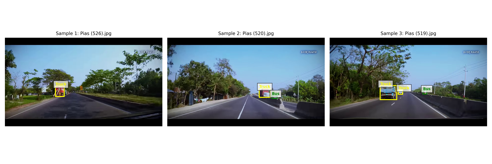

# 🚗 Vehicle Detection Dataset - Labelbox Portfolio

## 📋 Overview
This project involves the creation of a custom vehicle detection dataset using **Labelbox**. The dataset consists of **931 dashcam images** captured from some roads, annotated with a multi-class ontology to support object detection models like YOLOv8.

## 🖼️ Sample Visualization

Below is a sample of the annotated dataset showing multi-class vehicle detection with color-coded bounding boxes:



*🟡 Yellow: Truck | 🟢 Green: Bus | 🔵 Blue: Car*

## 🎯 Project Goals
- Build a high-quality annotated dataset for vehicle detection in local traffic conditions.
- Implement a robust annotation workflow using Labelbox's ontology features.
- Provide a clean, structured dataset ready for training computer vision models.

## ️ Annotation Schema
We used a **flat multi-class approach** with 3 distinct vehicle types for optimal model performance:

| Class | Bounding Box Color | Description |
|-------|-------------------|-------------|
| `Car` | 🔵 Blue | Sedans, hatchbacks, SUVs, sports |
| `Bus` | 🟢 Green | Public transport buses, minibus |
| `Truck` | 🟡 Yellow | Cargo trucks, container trucks, pickups |

### Why Flat Classes?
- Better compatibility with standard models (YOLO, Faster R-CNN)
- Easier visual quality control during labeling
- Granular evaluation metrics per class

## 📊 Dataset Statistics
*   **Total Uploaded Images:** 931
*   **Currently Labeled Subset:** 50 images *(Initial Quality Assurance Sample)*
*   **Annotation Format:** COCO JSON / YOLO TXT
*   **Class Distribution (Based on Labeled Subset):**
    *   🚛 **Truck:** ~80% (Dominant in current sample due to dashcam perspective)
    *   🚌 **Bus:** ~20%
    *    **Car:** 0% *(Not present in this specific batch)*

> ️ **Note:** The statistics above reflect only the initial 50 annotated images used for pipeline validation and visualization demonstration. Full dataset labeling is ongoing to achieve a balanced distribution across all vehicle classes for model training.

## 🛠️ Tools & Technologies
- **Annotation Tool:** Labelbox
- **Dataset Source:** Dashcam footage
- **Export Format:** COCO, YOLO
- **Analysis:** Python, Pandas, Matplotlib

## 📁 Repository Structure
```text
vehicle-detection-labelbox-portfolio/
├── data/
│   └── annotations/          # Contains exported annotation files from Labelbox
│       └── export_coco.json  # Main annotation file in NDJSON/COCO format
── docs/
│   └── annotation_guidelines.pdf # Comprehensive guidelines for labeling consistency (Ontology & Rules)
├── images/
│   ├── Pias (526).jpg        # Sample raw images used for visualization demo
│   ├── Pias (520).jpg
│   └── visualization_result.png # Output image showing bounding boxes on sample data
├── notebooks/
│   └── eda_labelbox.ipynb    # Jupyter Notebook for Exploratory Data Analysis (EDA) and class distribution stats
├── scripts/
│   └── visualize_annotations.py # Python script to parse JSON and visualize bounding boxes on images
├── .gitignore                # Git configuration to exclude large raw datasets and temporary files
└── README.md                 # Main documentation file for the project
